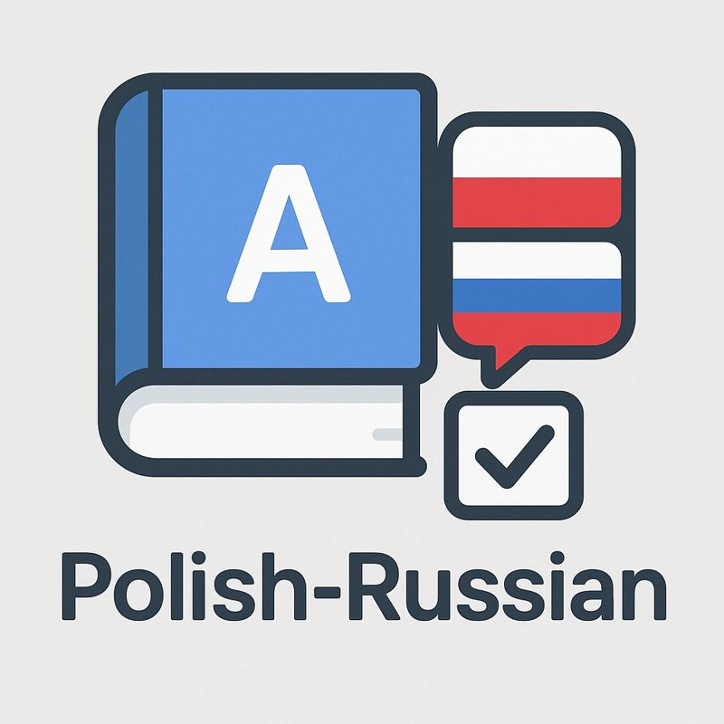

# Polish Vocabulary Trainer

A small educational project to help learn Polish, built with **Next.js (App Router) + TypeScript + Tailwind CSS**.



The project is built with a focus on:

- a fast MVP
- convenient data manipulation
- future expansion (tester, statistics)

---

## Features (MVP)

### 1. Vocabulary and Phrases

There is a single data source — a table of entries.

Each entry contains:

- Polish (`pl`)
- Russian (`ru`)
- `isWord: boolean` — word or phrase

In the UI this is displayed as **two pages**:

- `/words`
- `/phrases`

### 2. Table

For each table:

- column sorting
- filtering
- inline editing
- deleting entries
- adding a new entry (`+`)

### 3. Editing and Saving Mode

Editing follows a **"game save system"** approach:

- all changes live in the application state
- data is **not committed automatically**
- the user explicitly clicks **Save changes**

Before saving:

- data is considered a _draft_
- changes are persistently stored in `localStorage`

---

## Data Persistence

To prevent data loss on:

- page reload
- temporary network loss
- tab or browser close

a hybrid approach is used.

### Source of truth

- a JSON file in this repo, on the `data` branch: `data/vocabulary.json`
- read **publicly** via the GitHub raw URL (no token needed on the client)
- written **server-side only**, via a Next.js Server Action that uses
  `GITHUB_TOKEN` from environment variables

### Draft storage

- all unsaved changes are stored in `localStorage`
- key: `vocabulary:draft`

Behavior:

- on application start:
  - if a draft exists → it is used as the initial state
  - otherwise → data from GitHub is shown as-is
- on **Save changes**:
  - data is committed to GitHub via a Server Action
  - the draft is cleared

As a result:

- GitHub = source of truth
- localStorage = temporary reliability buffer
- the GitHub token never leaves the server

---

## Authentication

Only the owner can edit the vocabulary. All visitors see it read-only.

- a single `ADMIN_SECRET` is configured in environment variables
- `/login` accepts the secret and sets a signed, httpOnly cookie
- Server Actions verify the cookie before writing to GitHub

---

## Tech Stack

### Core

- Next.js 16 (App Router) + React 19
- TypeScript
- Tailwind CSS

### Tables

- **@tanstack/react-table** — headless table logic, full UI control

### Icons

- lucide-react

### Storage

- GitHub repository (`data` branch), file `data/vocabulary.json`
- `localStorage` for the unsaved draft

### Deployment

- **Vercel** (native support for Server Actions and env vars)

---

## Git Architecture

```txt
main      → application source code
data      → vocabulary data (vocabulary.json)
```

- the app **reads from and writes only to the `data` branch**
- code and data are fully separated

---

## Data Model

```ts
export interface Entry {
  id: string;
  pl: string;
  ru: string;
  isWord: boolean;
}

export interface VocabularyFile {
  version: number;
  updatedAt: string;
  entries: Entry[];
}
```

---

## Project Structure

```txt
src/
├─ app/
│   ├─ layout.tsx
│   ├─ page.tsx              # redirects to /words
│   ├─ words/page.tsx
│   ├─ phrases/page.tsx
│   ├─ tester/page.tsx       # placeholder for future tester
│   └─ login/page.tsx
│
├─ components/
│   ├─ vocabulary/
│   │   ├─ VocabularyTable.tsx
│   │   └─ SaveBar.tsx
│   └─ layout/
│       └─ Nav.tsx
│
├─ lib/
│   ├─ domain/               # entities and rules
│   │   ├─ Entry.ts
│   │   ├─ Vocabulary.ts
│   │   └─ vocabularyRules.ts
│   │
│   ├─ storage/              # I/O layer
│   │   ├─ VocabularyStorage.ts   # interface
│   │   ├─ GitHubStorage.ts
│   │   └─ LocalDraftStorage.ts
│   │
│   ├─ actions/              # Next.js Server Actions
│   │   ├─ saveVocabularyAction.ts
│   │   └─ loginAction.ts
│   │
│   └─ auth/
│       └─ session.ts        # cookie sign/verify, requireAdmin()
```

### Layered scheme

```txt
UI (React components)
  ↓
Server Actions (write path)        ←  Server Components (read path)
  ↓                                       ↓
Storage layer (GitHubStorage + LocalDraftStorage)
  ↓
Domain (models, rules)
```

---

## Environment Variables

Create `.env.local`:

```bash
# GitHub repo that holds the data branch
GITHUB_OWNER=DaveBullworth
GITHUB_REPO=plnvocab
GITHUB_DATA_BRANCH=data
GITHUB_DATA_PATH=data/vocabulary.json

# Personal access token with `contents:write` on the repo
GITHUB_TOKEN=ghp_xxx

# Admin login secret
ADMIN_SECRET=change-me
# Used to sign the admin cookie (any random string)
SESSION_SECRET=another-random-string
```

---

## Local Development

```bash
npm install
npm run dev
```

Open <http://localhost:3000>.

---

## Future Plans

### Tester

- mode selection: words / phrases
- number of questions selection
- random sampling
- Polish translation input
- answer validation

### Polish Keyboard

On-screen buttons:

```
ą ć ę ł ń ó ś ż ź
```

- inserts characters into the active input
- used in both the tester and editing modes

### Visual Design

The MVP is functionality-first. A custom design (likely adapted from a
Figma template) will be applied as a separate phase, expressed in
Tailwind utility classes.

---

> If an MVP can't be built in a couple of evenings, the stack is chosen incorrectly.
